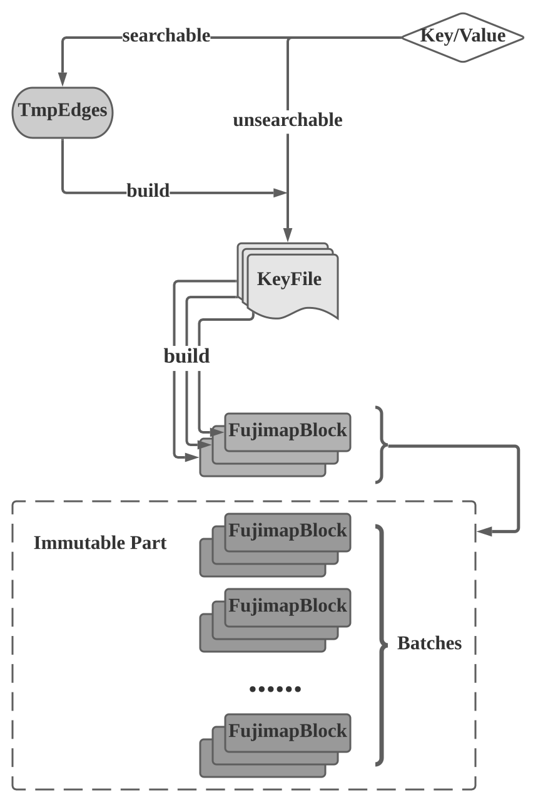
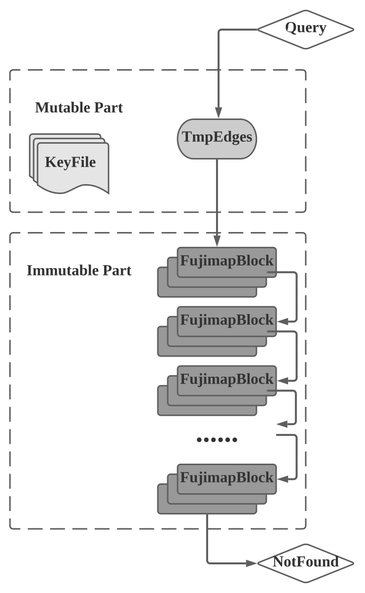

## fujimap 调研报告

### 原理

对于传统的 hash map，无论使用 linear probe 还是 chaining 处理冲突，都会导致一定的空间浪费，尤其是在 key/value 尺寸较小的情况下。为了减少内存损耗，研究人员提出了最小完美哈希函数，即通过计算出特定的哈希函数，从而将 key/value 紧凑地存储在数组中而不浪费任何空间。然而，这个方法一个致命的缺陷是 key/value 数目和内容必须已知，因此在动态变化的场景下需要不停地重建最小完美哈希。一个直观的做法是设定一个固定大小的 buffer，每次 buffer 插满就对其所包含的 key/value 批量建立最小完美哈希，这正是 fujimap 的核心思想之一。

在此基础上，如果我们的应用场景允许出现 false positive（例如我们想用来减小点查的读放大，只需要对于存在的主键能返回正确的位置即可。就算返回了假阳结果，也只是多读一次实际数据的开销），还可以进一步引入近似计算技术来极端地压缩空间占用，同时提供比较可观的查询性能，当然代价是构建 succinct 结构的耗时相对比较长，并且如果 key/value set 太大，计算最小完美哈希的耗时也会很长，空间占用会比较高。

结合以上两点，fujimap 的原理就很容易理解了。首先自然是采用上文提到的 buffer hashtable 来缓存插入的 key/value pair，插满以后将整个 buffer 中所有 raw key/value 进行处理，去重后转化成有序的 edges，即后续计算最小完美哈希时用来构建 hypergraph 的中间结构。为了进一步缩减空间占用，fujimap 在 immutable part 中并不实际存储 key 值，因此整个空间占用只和 value 大小以及假阳率有关。构建最小完美哈希时，如果直接对整个 buffer 的所有数据进行计算，内存占用会非常大，并且耗时会比较长。fujimap 的做法是先用一个简单的哈希函数将数据分区，将分区数记为 BlockN。每次 buffer 满时，将每个 key/value pair 划分到某个 block 中，再对 BlockN 个分区分别构建最小完美哈希。

总结一下 fujimap 涉及到的技术：

* 分层结构。buffer 输入，批量转化成空间、查询友好的 immutable part；immutable part 新旧分层，查询时从新往旧查
* 近似计算。通过允许假阳性，极端压缩空间占用，同时保证较好的查询性能。从表现上来看，immutable part 类似一个能存 value 的 bloom filter
* 数据分区。为了避免过高的内存峰值占用和计算耗时，将一个 batch 的数据分区后分别构建最小完美哈希+succinct 结构，从而缓解压力。另一个角度来讲，分成若干个无依赖关系的 partition 在构建时也能具备更好的并行性

### 实现

#### 术语

* `Fujimap`：索引的主体，对外主要提供如下 API：
  * `setInteger`：insert or update 给定 key/value，key 为变长 string，value 为定长整型。可以指定输入是否需要立即可见
  * `setString`：insert or update 给定 key/value，key、value 为变长 string。实际是为 value 额外维护了一层 string -> hash 的映射，本质上插入 fujimap 的 value 还是定长整型
  * `getInteger`、`getString`：功能类似，先在内存的 buffer 中查找，如果找不到再到 blocks 中查找，还找不到则返回 `NOTFOUND`
  * `build`：把当前内存 buffer 中的 key/value pair 全部处理成 edges 并刷入 temp file 中，再对当前的 temp file 进行分区最小完美哈希构建。原则上内存 buffer 达到阈值后会自动触发该函数，除此之外只有用户手动调用来进行构建
  * `load`、`save`：全量序列化并持久化/读入全量索引数据并反序列化
* `KeyFile`：一个用来存放不需要立即可见的 key/value 的中间层。相比于插入内存 buffer，直接将 key/value 写入 key file 要更为快速，并且可以避免 build 时重新从 buffer 导入 key file（原版代码的逻辑是，所有 build 都以 key file 为 source，在 build 前会把 buffer 中所有的 key/value 先写入 key file）。从行为上可以理解为内存 buffer 的 spill part，主要目的是降低内存使用，让一次 build 尽可能包括更多数据
* `TmpEdges`：即上文提到的内存 buffer，本质上就是一个常驻内存的 hashtable，当然也可以根据 workload 替换其他任何支持点查的内存结构，或者其他 hashtable 变种
* `FujimapBlock`：fujimap 的核心结构，最小完美哈希+succinct 表示，包括一次 build 中的一个分区的 key/value。构建最小完美哈希时使用了[Simple and Space-Efficient Minimal Perfect Hash Functions](http://cmph.sourceforge.net/papers/wads07.pdf)中的方法，其他相关细节将在后续解析
* `KeyEdge`：用于构建 block 的一种中间结构，代表一个 key/value pair。具体来讲其中包括 value 本身以及额外 R 个 uint64 类型的标记位（R 是人为定义的，表示）
* `Batch`：这个并不是原版代码中的概念，为了后续讲解方便，用 batch 指代一次 build 过程中所有参与构建的数据，即 key file 中的所有分区；也可能指一次 build 产生的若干个（BlockN）block

#### 流程

##### 更新

1. 是否需要立即可见？若不需要则直接写入 KeyFile 返回，若需要则插入 TmpEdges
2. TmpEdges 是否已满？若未满则直接返回，否则进入 build 流程
3. build 过程：
   1. 将 TmpEdges 中所有 key/value pair 写入 KeyFile，并将 TmpEdges 清空
   2. 对于 BlockN 个分区，分别从 KeyFile 中加载对应分区的 key/value pair，并构建对应的 block。在构建之前，对于每个 key/value pair，会生成一个中间结构 KeyEdge，其中包含 value 实际值和 R 个 uint64 类型的标记位，后者通过对 key 做哈希并进行一些处理得到
   3. 清空 KeyFile，将生成的一个新 batch（即 BlockN 个 block）加入到 immutable part 的头部

##### 查询

1. 先在 TmpEdges 中查找，如果找到则直接返回，否则进入 immutable part
2. 使用与插入时同样的哈希处理对 key 进行变换得到与输入 key/value pair 相关联的 KeyEdge，后续用此结构进行查找
3. 由新往旧遍历 immutable part 的 batches，对于每个 batch，先用 key 得到 blockId，再到对应的 block 中用上一步得到的 KeyEdge 搜索，如果找到对应 value 则直接返回。这里因为是从新往旧查，更新的 value 会覆盖老 value
4. 遍历完整个 immutable part 后如果还没查到，则返回 not found

### 性能

#### False Positive

| N        | TmpN    | FpLen (bits) | BlockN | Set (sec) | Get (sec) | FP Rate | Space (byte) |
| -------- | ------- | ------------ | ------ | --------- | --------- | ------- | ------------ |
| 10000000 | 1000000 | 0            | 128    | 6.834     | 0.868     | 0.9     | 36670120     |
| 10000000 | 1000000 | 2            | 128    | 6.799     | 2.583     | 0.623   | 39929220     |
| 10000000 | 1000000 | 4            | 128    | 6.812     | 4.029     | 0.240   | 43188288     |
| 10000000 | 1000000 | 8            | 128    | 6.842     | 4.763     | 0.018   | 49706320     |
| 10000000 | 1000000 | 16           | 128    | 6.866     | 5.235     | 0.001   | 62742976     |
| 10000000 | 1000000 | 32           | 128    | 6.801     | 5.684     | 0       | 88816064     |

| N        | TmpN   | FpLen (bits) | BlockN | Set (sec) | Get (sec) | FP Rate | Space (byte) |
| -------- | ------ | ------------ | ------ | --------- | --------- | ------- | ------------ |
| 10000000 | 500000 | 0            | 128    | 6.273     | 0.884     | 0.95    | 36670120     |
| 10000000 | 500000 | 2            | 128    | 6.268     | 2.556     | 0.81    | 39929220     |
| 10000000 | 500000 | 4            | 128    | 6.250     | 5.694     | 0.42    | 43188288     |
| 10000000 | 500000 | 8            | 128    | 6.247     | 8.103     | 0.04    | 49706320     |
| 10000000 | 500000 | 16           | 128    | 6.263     | 8.972     | 0.001   | 62742976     |
| 10000000 | 500000 | 32           | 128    | 6.220     | 9.835     | 0       | 88816064     |

| N         | TmpN     | FpLen (bits) | BlockN | Set (sec) | Get (sec) | FP Rate | Space (byte) |
| --------- | -------- | ------------ | ------ | --------- | --------- | ------- | ------------ |
| 100000000 | 10000000 | 0            | 128    | 82.044    | 16.223    | 0.90    | 36670120     |
| 100000000 | 10000000 | 2            | 128    | 81.513    | 37.369    | 0.623   | 39929220     |
| 100000000 | 10000000 | 4            | 128    | 82.477    | 52.245    | 0.240   | 43188288     |
| 100000000 | 10000000 | 8            | 128    | 83.886    | 60.164    | 0.018   | 49706320     |
| 100000000 | 10000000 | 16           | 128    | 82.416    | 61.884    | 0.001   | 62742976     |
| 100000000 | 10000000 | 32           | 128    | 81.938    | 63.455    | 0       | 88816064     |

* **场景：** N 个 key/value pair <string(i), uint64(i)> where i = 0...N-1 依次插入 fujimap，所有插入都不走 key file 确保可见，然后再依次查询，记录插入、查询总耗时，假阳率，以及空间占用。

* **结论：** 在当前场景 fpLen 分配 8 个 bit 时初步具有可用性，分配 16 个以上的话几乎不出现假阳。分配的 bit 数和空间占用（的某一部分）呈线性关系，也会对查询速度造成一定影响（主要是假阳检测起效，搜索了更多的 block），对插入性能影响不大。假阳率和数据规模无关，和 batch 数目有关，batch 越多假阳率越高。

#### N/TmpN （Batch 总数）

| N        | TmpN     | FpLen (bits) | BlockN | Set (sec) | Get (sec) | FP Rate | Space (byte) |
| -------- | -------- | ------------ | ------ | --------- | --------- | ------- | ------------ |
| 10000000 | 50000    | 16           | 128    | 5.672     | 75.948    | 0.002   | 65928376     |
| 10000000 | 100000   | 16           | 128    | 5.949     | 38.889    | 0.001   | 64170304     |
| 10000000 | 1000000  | 16           | 128    | 6.837     | 5.246     | 0.001   | 62742976     |
| 10000000 | 10000000 | 16           | 128    | 7.260     | 1.658     | 0       | 65018648     |

| N         | TmpN      | FpLen (bits) | BlockN | Set (sec) | Get (sec) | FP Rate | Space (byte) |
| --------- | --------- | ------------ | ------ | --------- | --------- | ------- | ------------ |
| 100000000 | 100000    | 16           | 128    | 62.411    | N/A       | 0.002   | 671836217    |
| 100000000 | 1000000   | 16           | 128    | 70.958    | 475.457   | 0.001   | 679416464    |
| 100000000 | 10000000  | 16           | 128    | 82.021    | 61.955    | 0.001   | 682696536    |
| 100000000 | 100000000 | 16           | 128    | 99.2549   | 19.01     | 0       | 698770080    |

* **场景：** 同上
* **结论：** 首先插入、查询的耗时肯定是和数据规模有关的，暂时忽略这一因素，考虑规模不变的情况下 batch 数目的影响。可以发现随着 batch 数目减少，插入性能有略微的下降（因为一次 build 过程如果 key/value pair 过多会导致计算非常复杂，并且内存占用会比较高，这个之前在原理部分有提及），但是查询性能提升非常明显，基本是和 batch 数目呈负相关。这一特性同样和数据规模无关，基本任何规模的表现都类似。因此如果要用的话，需要控制 immutable part 的 batch 数目，比如定期 merge；一方面是控制 batch 数目，另一方面是 gc 掉旧版本的数据，否则无限制地增长的话空间放大会很严重。当然，TmpN 的设置也需要考虑，太小的话无疑会加重后台任务的压力，这些东西和 LSM Tree 里的 tradeoff 是类似的。

#### BlockN

| N        | TmpN    | FpLen (bits) | BlockN | Set (sec) | Get (sec) | FP Rate | Space (byte) |
| -------- | ------- | ------------ | ------ | --------- | --------- | ------- | ------------ |
| 10000000 | 1000000 | 16           | 8      | 7.581     | 5.191     | 0.001   | 62573856     |
| 10000000 | 1000000 | 16           | 16     | 7.543     | 5.109     | 0.001   | 62585088     |
| 10000000 | 1000000 | 16           | 32     | 7.305     | 5.143     | 0.001   | 62607664     |
| 10000000 | 1000000 | 16           | 64     | 7.208     | 5.164     | 0.001   | 62652944     |
| 10000000 | 1000000 | 16           | 128    | 6.967     | 5.287     | 0.001   | 62742976     |
| 10000000 | 1000000 | 16           | 256    | 6.542     | 5.262     | 0.001   | 62924384     |
| 10000000 | 1000000 | 16           | 512    | 6.365     | 5.158     | 0.001   | 63285656     |
| 10000000 | 1000000 | 16           | 1024   | 6.397     | 5.242     | 0.001   | 64007280     |
| 10000000 | 1000000 | 16           | 2048   | 6.388     | 5.253     | 0.001   | 65454968     |
| 10000000 | 1000000 | 16           | 4096   | 6.597     | 5.565     | 0.001   | 68348144     |

* **场景：** 同上
* **结论：**基本上是正态分布的规律，即随着 BlockN 增大，插入、查询性能先增后降，其他指标影响不大。

### 总结

